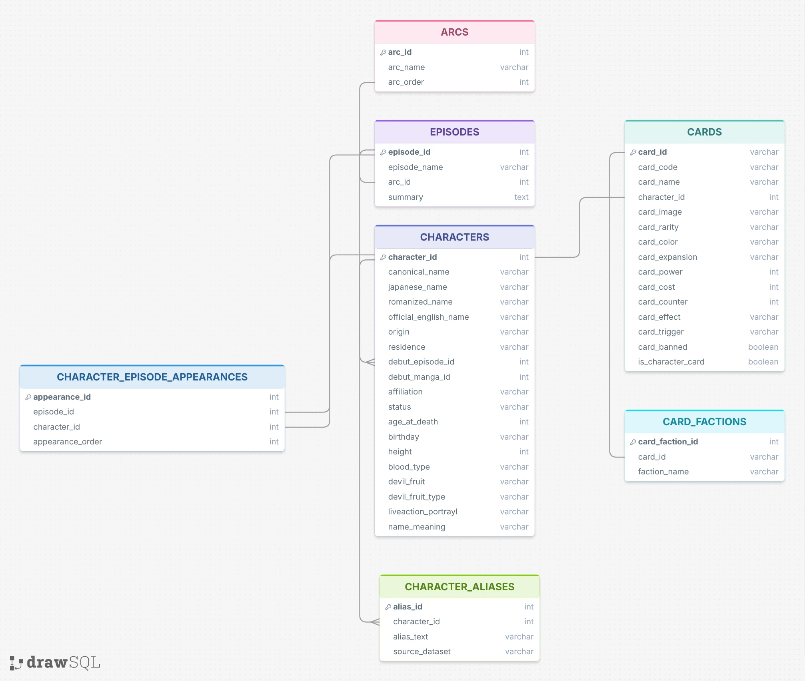

# One Piece Relational ETL Database

A normalized relational database that links **One Piece** anime/manga data (characters, episodes, story arcs) to the **One Piece Trading Card Game**, built with a pandas ETL pipeline and loaded into Postgres.

Three independently-sourced datasets a wiki scrape of characters, an episode/arc list, and a TCG card database. They share no common ID and use different name spellings for the same character. The pipeline resolves that issue. It builds one canonical name and ID per character, maps every alternate spelling from every source onto it, and produces seven clean, foreign-key-linked tables that can answer questions no single source could answer alone, such as:

- Does a character's death status affect how often they're chosen for cards?
- Does appearing in more episodes correlate with having more cards?
- Do characters who debut earlier in the story end up with rarer cards?

## Entity-relationship diagram



Seven tables: `arcs`, `episodes`, `characters`, `character_aliases`, `character_episode_appearances`, `cards`, and `card_factions`. Full column-level DDL is in [`schema.sql`](schema.sql).

## How the pipeline works

The notebook ([`One_Piece_Database.ipynb`](One_Piece_Database.ipynb)) follows a standard Extract → Transform → Load structure.

## Data sources

Original raw data comes from three Kaggle datasets, all released for free use:

- [One Piece Episode Summaries (Episodes 1–1130)](https://www.kaggle.com/datasets/tejadhiya/one-piece-episode-summaries-episodes-1-1130/data)
- [One Piece TCG Card Database – July 2025](https://www.kaggle.com/datasets/jbowski/one-piece-tcg-card-database?resource=download)
- [One Piece Dataset](https://www.kaggle.com/datasets/mexwell/one-piece-dataset) (character wiki data)

The underlying character, episode, and card data ultimately belongs to Eiichiro Oda / Shueisha / Toei Animation / Bandai; this project is a fan-made, non-commercial data engineering exercise.

### Data files

Both the raw and processed data are checked into this repo so anyone can explore or rerun the pipeline without hunting down the original Kaggle files:

- `data/raw/` — the three source CSVs exactly as downloaded from Kaggle (`one_piece_tcg.csv`, `one_piece_episodes.csv`, `one_piece_characters.csv`).
- `data/processed/` — the seven cleaned, final tables as CSVs (`arcs`, `episodes`, `characters`, `character_aliases`, `character_episode_appearances`, `cards`, `card_factions`), produced by actually running the notebook's Extract + Transform steps against the raw files above.

## Setup

```bash
git clone <this-repo-url>
cd one-piece-relational-etl
python -m venv .venv && source .venv/bin/activate
pip install -r requirements.txt
```

1. Raw data is already in `data/raw/` — no download needed to just explore or rerun the transform.
2. Copy `.env.example` to `.env` and fill in `DATABASE_URL` with a Postgres connection string (any standard Postgres works — a free tier on [Aiven](https://aiven.io) or a local instance). Only needed if you want to run the Load section and query a real database.
3. Run `jupyter notebook One_Piece_Database.ipynb` and run all cells top to bottom.

Alternatively, run everything against the tables directly with `psql` using [`schema.sql`](schema.sql) and the CSVs in `data/processed/`.

## Sample queries

From the notebook's "Check It" section, run against the loaded database:

**How many cards does each character have?**

| canonical_name | card_count |
|---|---|
| Monkey D. Luffy | 120 |
| Sanji | 54 |
| Nami | 52 |
| Trafalgar D. Water Law | 50 |
| Roronoa Zoro | 47 |

**Does a character's debut arc predict how many cards they get?**

| arc_name | arc_order | characters_debuted | total_card_count |
|---|---|---|---|
| Romance Dawn Arc | 1 | 18 | 259 |
| Orange Town Arc | 2 | 23 | 109 |
| Syrup Village Arc | 3 | 19 | 21 |
| Baratie Arc | 4 | 17 | 95 |
| Dressrosa Arc | 53 | 92 | 191 |
| Wano Country Arc | 60 | 214 | 157 |

**Does more episode appearances mean rarer (SEC) cards?**

| canonical_name | sec_card_count | episode_appearances |
|---|---|---|
| Monkey D. Luffy | 15 | 1075 |
| Shanks | 5 | 78 |
| Roronoa Zoro | 4 | 797 |
| Charlotte Katakuri | 4 | 49 |

See the notebook for the full query SQL and complete results.

## Power BI

The three sample queries above are also visualized in Microsoft Power BI — see docs/query_data_visualizations_microsoft_power_bi.pdf for the exported charts.

## Tech stack

pandas / numpy for the ETL, Postgres for storage, psycopg2 for loading, all made from a single Jupyter notebook.

## License

Code and documentation in this repo are MIT-licensed (see [`LICENSE`](LICENSE)). The underlying One Piece data is not, see [Data sources](#data-sources).
